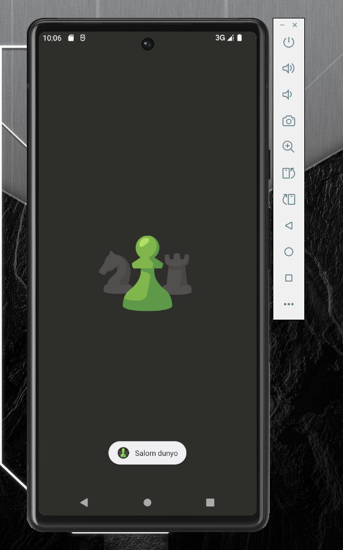

# Chess.com test APK’da Toast chiqarish — komandalar ketma-ketligi

## 1. APK’ni decode qilish

```cmd
java -jar apktool.jar d chess.apk -o chess_decoded
```

**Vazifasi:** APK faylni ochib, ichidagi `smali`, `res`, `AndroidManifest.xml` va boshqa fayllarni tahrirlash mumkin bo‘lgan ko‘rinishga chiqaradi.

---

## 2. `SplashActivity.smali` faylidan backup olish

```cmd
copy C:\apktool\chess_decoded\smali_classes9\com\chess\splash\SplashActivity.smali C:\apktool\SplashActivity_backup.smali
```

**Vazifasi:** original `SplashActivity.smali` faylining nusxasini saqlab qo‘yadi. Xato bo‘lsa eski holatga qaytish mumkin.

---

## 3. Toast kodini qo‘shish

`SplashActivity.smali` ichiga quyidagi metod qo‘shildi:

```smali
.method private static showHello(Landroid/content/Context;)V
    .locals 2

    const-string v0, "Salom dunyo"

    const/4 v1, 0x0

    invoke-static {p0, v0, v1}, Landroid/widget/Toast;->makeText(Landroid/content/Context;Ljava/lang/CharSequence;I)Landroid/widget/Toast;

    move-result-object v0

    invoke-virtual {v0}, Landroid/widget/Toast;->show()V

    return-void
.end method
```

**Vazifasi:** ekranga qisqa vaqtga `Salom dunyo` yozuvini chiqaradi.

Keyin `onCreate` ichidan `showHello()` metodi chaqirildi. Shu sababli ilova ochilganda Toast chiqadi.

---

## 4. APK’ni qayta build qilish

```cmd
cd C:\apktool
java -jar apktool.jar b chess_decoded -o chess_burp_unsigned.apk
```

**Vazifasi:** o‘zgartirilgan `smali` fayllardan yangi APK yaratadi.

Muvaffaqiyatli bo‘lsa:

```text
Built apk into: chess_burp_unsigned.apk
```

chiqadi.

---

## 5. APK’ni `zipalign` qilish

Bizda Android Build Tools versiyasi:

```text
36.0.0
```

Buyruq:

```cmd
"%LOCALAPPDATA%\Android\Sdk\build-tools\36.0.0\zipalign.exe" -v -p 4 C:\apktool\chess_burp_unsigned.apk C:\apktool\chess_burp_aligned.apk
```

**Vazifasi:** APK ichidagi fayllarni Android uchun to‘g‘ri tartiblaydi.

Muvaffaqiyatli natija:

```text
Verification successful
```

---

## 6. APK’ni sign qilish

Android Studio yaratgan debug keystore ishlatildi:

```text
%USERPROFILE%\.android\debug.keystore
```

Buyruq:

```cmd
"%LOCALAPPDATA%\Android\Sdk\build-tools\36.0.0\apksigner.bat" sign ^
--ks "%USERPROFILE%\.android\debug.keystore" ^
--ks-key-alias androiddebugkey ^
--ks-pass pass:android ^
--key-pass pass:android ^
--out C:\apktool\chess_burp_signed.apk ^
C:\apktool\chess_burp_aligned.apk
```

**Vazifasi:** APK’ga raqamli imzo qo‘yadi. Android sign qilinmagan APK’ni odatda o‘rnatmaydi.

---

## 7. Sign to‘g‘ri qo‘yilganini tekshirish

```cmd
"%LOCALAPPDATA%\Android\Sdk\build-tools\36.0.0\apksigner.bat" verify --verbose C:\apktool\chess_burp_signed.apk
```

**Vazifasi:** APK imzosi to‘g‘ri ekanini tekshiradi.

Bizda quyidagi natija chiqdi:

```text
Verifies
Verified using v3 scheme (APK Signature Scheme v3): true
```

---

## 8. APK’ni emulatorga o‘rnatish

```cmd
"%LOCALAPPDATA%\Android\Sdk\platform-tools\adb.exe" install -r C:\apktool\chess_burp_signed.apk
```

**Vazifasi:** tayyor APK’ni Android emulatorga o‘rnatadi.

Muvaffaqiyatli natija:

```text
Success
```

---

## 9. Natijani tekshirish

Chess.com test ilovasi emulator’da ochildi.

Ilova ochilganda ekranda:

```text
Salom dunyo
```

Toast xabari chiqdi.

---

## Qisqa ketma-ketlik

```text
APK decode
↓
SplashActivity.smali backup
↓
Toast kodi qo‘shildi
↓
APK build
↓
zipalign
↓
APK sign
↓
Sign verify
↓
ADB orqali install
↓
Ilova ochildi
↓
"Salom dunyo" Toast chiqdi
```

---

## Natija rasmi

Ilova ishga tushirilganda `Salom dunyo` Toast xabari muvaffaqiyatli chiqdi.



